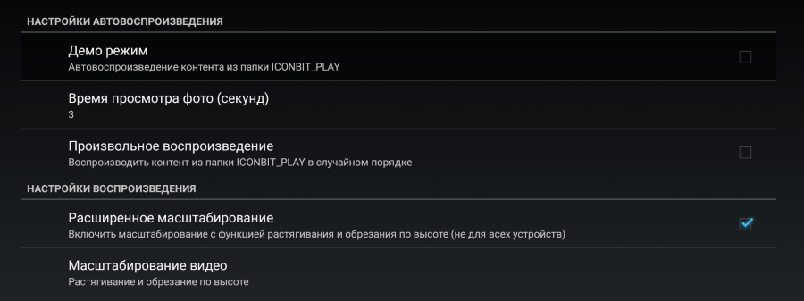
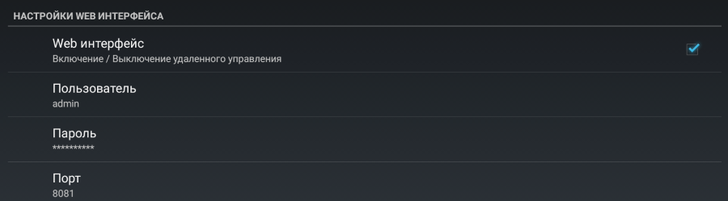
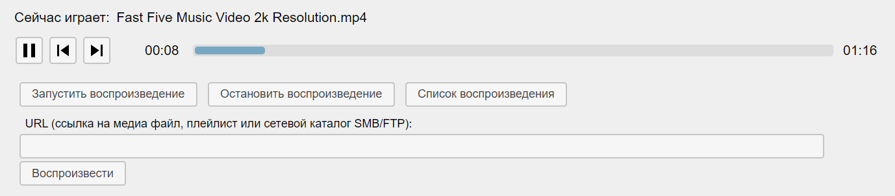
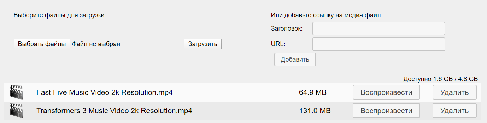

# Использование функции автовоспроизведения

Предназначено для [ТВ-приставок](http://www.iconbit.ru/products/players/) на базе ОС Android версии 4.0 и выше. Совместимость с версией приложения указано в виде «(>=версия)».

## Содержание

- [Общие сведения](#общие-сведения)
- [Настройки автовоспроизведения](#настройки-автовоспроизведения)
- [Удаленное управление](#удаленное-управление)

## Общие сведения

Функция автовоспроизведения предназначена для непрерывного последовательного или произвольного воспроизведения видео / фото / аудио файлов из каталога ICONBIT_PLAY на внутреннем или внешнем устройстве хранения информации.

При последовательном воспроизведении список упорядочивается по имени файла, при произвольном файлы перемешиваются случайным образом.

Каталог ICONBIT_PLAY можно создать вручную или через удаленное управление (>=0.3.1).

[Вернуться к содержанию](#содержание) | [Вернуться в начало раздела](#общие-сведения)

## Настройки автовоспроизведения

Для того, чтобы открыть настройки, выберите пункт «Настройки демо режима» параметрах интерфейса или настройках [iconBIT](http://www.iconbit.ru/) лаунчера. В результате на экране отобразится следующее:

Настройки содержат следующие элементы:

- Демо режим - включение / отключение запуска воспроизведения из папки ICONBIT_PLAY при старте устройства или подключении диска
- Время просмотра фото (секунд) - время отображения фото по умолчанию, если после фото идет аудио файл то время просмотра определяется продолжительностью аудио файла
- Произвольное воспроизведение - включение / отключение воспроизведения контента в случайном порядке
- Расширенное масштабирование - включение / отключение поддержки автоматического масштабирования
- Масштабирование видео

[Вернуться к содержанию](#содержание) | [Вернуться в начало раздела](#настройки-автовоспроизведения)

## Удаленное управление

Совместимо с (>=0.3.1). 

### Включение и выключение

Чтобы включить удаленное управление откройте [настройки автовоспроизведения](#настройки-автовоспроизведения) и перейдите к разделу «Настройки Web интерфейса»

Настройки содержат следующие элементы:

- Web интерфейс - включение / выключение удаленного управления
- Пользователь (по умолчанию - admin)
- Пароль  (по умолчанию - admin, рекомендуется придумать свой пароль) 
- Порт (по умолчанию - 8081) 

### Интерфейс

Чтобы открыть удаленное управление на вашем ПК откройте интернет браузер (рекомендуется использовать браузер **Яндекс браузер**, **Google Chrome** или **Firefox** актуальной версии).

Введите адрес http://IP:8081, где:

- IP — сетевой адрес (отображается в главном меню [iconBIT](http://www.iconbit.ru/) лаунчера или в настройках сети)
- 8081 — порт сервера заданный в настройках (см. выше). 

Интерфейс можно разделить на 3 части:

1. [Информация об устройстве](#информация-об-устройстве)
2. [Управление воспроизведением](#управление-воспроизведением)
3. [Управление файлами в каталоге ICONBIT_PLAY](#управление-файлами-в-каталоге-iconbit_play)

#### Информация об устройстве

Содержит следующие элементы:

-  - сделать скриншот экрана (не для всех устройств)
- модель устройства
- версия приложения (версия ОС Android)

#### Управление воспроизведением

Содержит следующие элементы:

- сейчас играет - заголовок текущего  контента
- кнопка  /  - приостановить / продолжить воспроизведение текущего контента
- кнопка  - перейти к предыдущему контенту по списку (>=0.3.3)
- кнопка  - перейти к следующему контенту по списку
- время воспроизведения текущего  контента
- временная шкала с возможностью перемотки по клику мыши
- продолжительность текущего  контента
- кнопка `Запустить воспроизведение` - запустить / перезапустить воспроизведение из каталога ICONBIT_PLAY
- кнопка `Остановить воспроизведение`
- кнопка `Список воспроизведения` (>=0.3.3) - показать текущий список воспроизведения (плейлист)
- **URL** - адрес для запуска воспроизведения по ссылке
- кнопка `Воспроизвести` - запустить воспроизведение по ссылке **URL**

В качестве ссылки **URL** может выступать:

- путь к файлу на локальном диске или в сети HTTP / FTP / SMB
- локальный или сетевой каталог FTP / SMB
- ссылка на онлайн трансляции, включая IPTV
- плейлист в формате M3U, XSPF, CUE, PLS, ASX, B4S, WPL, URL, RAM, PXML
- [YouTube](https://youtube.com/) плейлист (>=0.3.3) 
- ссылка на популярный видео хостинг: [YouTube](https://youtube.com/), [vimeo](https://vimeo.com/) и т.д.  (>=0.3.2) 

#### Управление файлами в каталоге ICONBIT_PLAY

Кнопка «Создать каталог для автовоспроизведения» служит для создания каталога ICONBIT_PLAY на внешнем или внутреннем устройстве хранения информации. При создании каталога внешний диск имеет приоритет.

После создания каталога будет доступно управление файлами.

В правом углу отображается информация о диске — свободно / всего.

Чтобы загрузить  выберите файл(ы), нажмите кнопку «Добавить» / «Загрузить» (>=0.3.2)  и дождитесь окончания загрузки.

Чтобы удалить файл нажмите соответствующую  кнопку напротив нужного файла и подтвердите операцию.

`При работе с файлами рекомендуется остановить воспроизведение!`

[Вернуться к содержанию](#содержание) | [Вернуться в начало раздела](#удаленное-управление)