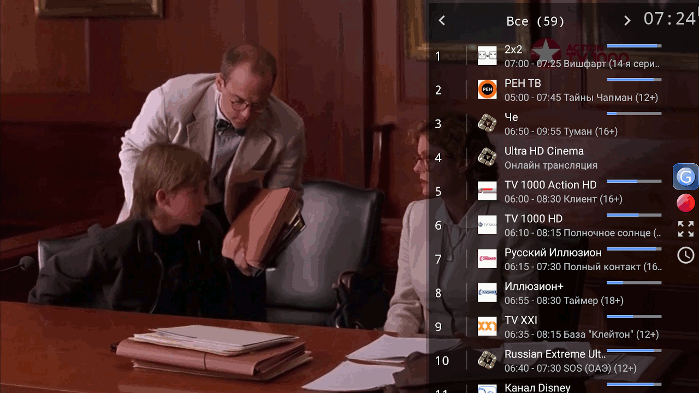
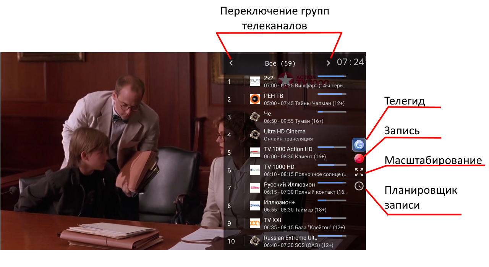

# Просмотр IPTV в приложении "Медиацентр"

Предполагается, что у вас есть плейлист от вашего провайдера. Если это не так, то вам необходимо запросить плейлист у провайдера (обычно можно скачать с официального сайта).

Файл плейлиста должен быть в формате, который поддерживается приложением. Рекомендуется использовать плейлист в кодировке UTF-8.
Чтобы начать просмотр откройте пункт «Плейлисты». В окне найдите ваш плейлист и откройте его. В результате отобразится список каналов, чтобы запустить просмотр наведите курсор на нужный канал и откройте его.



## Формат M3U плейлиста

```m3u
#EXTM3U Общие параметры
#EXTINF:-1 Параметры канала 1 ,Канал 1
адрес-канала-1
#EXTINF:-1 Параметры канала 2 ,Канал 2
адрес-канала-2

#EXTVLCOPT:http-user-agent=Monkey
#EXTINF:-1 Параметры канала 3 ,Канал 3
адрес-канала-3
```

Вставки с параметрами должны иметь вид: параметр1=значение1 параметр2=значение2 ...

Общие параметры:

- `url-tvg` - адрес архива с телепрограммой (можно несколько адресов через запятую)
- `tvg-shift` - часовой сдвиг
- `catchup-source` - адрес (шаблон) для просмотра архива телеканала
- `catchup-days` - количество дней за который доступен архив

Параметры каналов:

- `url-tvg` - адрес архива с телепрограммой (можно несколько адресов через запятую)
- `tvg-name` - имя канала в файле телепрограммы
- `tvg-id` - идентификатор канала в файле телепрограммы
- `tvg-shift` - часовой сдвиг
- `tvg-logo` - адрес изображения
- `group-title` - группа телеканала
- `catchup-source` - адрес (шаблон) для просмотра архива телеканала
- `catchup-days` - количество дней за который доступен архив

## Управление в встроенном плеере

Кнопка               |  Действие                                                                |
---------------------|:-------------------------------------------------------------------------|
Выбор (OK)           | Открыть список телеканалов                                               |
Вверх                | Перейти к следующему каналу по списку                                    |
Вниз                 | Перейти к предыдущему каналу по списку                                   |
Влево                | Перейти к предыдущему каналу                                             |
Вправо               | Запись телеканала                                                        |
0-9                  | Набор номера телеканала согласно расположению в списке                   |
Назад (back)         | Выйти из просмотра                                                       |

При открытии списка телеканалов доступны дополнительные функции:



## Управление в встроенном плеере при просмотре архива

Кнопка               |  Действие                                                                |
---------------------|:-------------------------------------------------------------------------|
Выбор (OK)           | Открыть меню действий                                                    |
Вверх                | Перемотать на 3 минуты вперёд                                            |
Вниз                 | Перемотать на 3 минуты назад                                             |
Влево                | Перемотать на 1 минуту назад                                             |
Вправо               | Перемотать на 1 минуту вперёд                                            |
0-9                  | Набор номера телеканала согласно расположению в списке                   |
Назад (back)         | Выйти из просмотра архива                                                |
