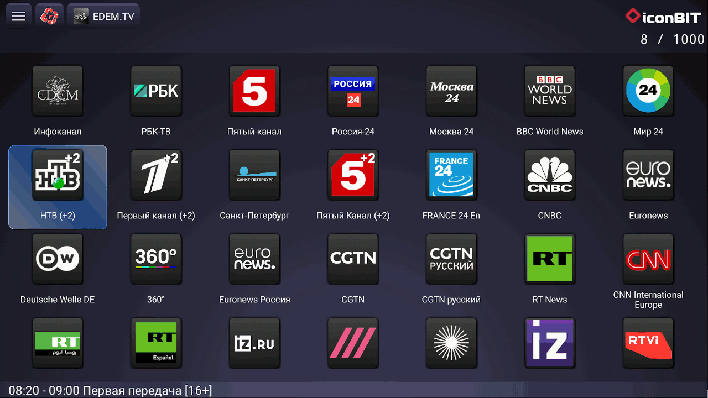

# Просмотр IPTV

Предназначено для <a href="http://www.iconbit.ru/products/players/" target="_blank">ТВ-приставок</a> на базе ОС Android версии 4.0 и выше. Совместимость с версией приложения указано в виде «(>=версия)».



## Содержание

- [Добавление плейлиста](#добавление-плейлиста)
- [Просмотр в встроенном плеере](#просмотр-в-встроенном-плеере)
- [Формат M3U плейлиста](#формат-m3u-плейлиста)

## Добавление плейлиста

Предполагается, что у вас есть плейлист (или ссылка) от вашего провайдера и подключена услуга IP-телевидения или плейлист с каналами из открытых источников.

Плейлист должен быть в формате M3U, XSPF, CUE, PLS, ASX, B4S, WPL, URL, RAM, PXML.

Рекомендуется использовать плейлист в кодировке UTF-8.

### Добавление файла-плейлиста

- Скопируйте файл плейлиста на <a href="https://ru.wikipedia.org/wiki/USB-флеш-накопитель" target="_blank">USB-флеш-накопитель</a>
- Подключите <a href="https://ru.wikipedia.org/wiki/USB-флеш-накопитель" target="_blank">USB-флеш-накопитель</a> к ТВ-приставке
- Откройте приложение  **Медиацентр**
- Откройте раздел  **Плейлисты**
- Откройте ваш плейлист

Чтобы не подключать каждый раз USB-флеш-накопитель файл плейлиста можно скопировать на внутренний диск. Для этого откройте файловый менеджер и выполните соответствующие действия.

При необходимости вы можете добавить ссылку на главную страницу приложения, для этого наведите курсор на ваш плейлист, нажмите и не отпускайте кнопку выбора не менее 3 секунд и в всплывающем меню выберите **Добавить ссылку**.

### Добавление ссылки на самообновляемый плейлист

- Откройте приложение  **Медиацентр**
- Откройте меню приложения по кнопке (верхний левый угол)
- Выберите пункт **Добавить**.
- Введите адрес плейлиста в поле напротив надписи **URL**
- Нажмите **Сохранить**

В результате ссылка будет добавлена на главную страницу приложения в начало списка.

[Вернуться к содержанию](#содержание) | [Вернуться в начало раздела](#добавление-плейлиста)

## Просмотр в встроенном плеере

### Управление

| Кнопка       | Действие                                               |
| ------------ | :----------------------------------------------------- |
| Выбор (OK)   | Открыть список телеканалов                             |
| Вверх        | Перейти к следующему каналу по списку                  |
| Вниз         | Перейти к предыдущему каналу по списку                 |
| Влево        | Перейти к предыдущему каналу                           |
| Вправо       | Запись телеканала                                      |
| 0-9          | Набор номера телеканала согласно расположению в списке |
| Назад (back) | Выйти из просмотра                                     |

### Список телеканалов

В списке телеканалов доступны следующие функции:

-   - Переключение между группами телеканалов
-  - Открыть телепрограмму текущего канала
-  - Запись текущего канала
-   - Масштабирование изображения
-  - Открыть планировщик записи
-  - Выбрать звуковую дорожку (если есть возможность)
-  - Выбор субтитров (если есть возможность)  (>=0.3.4)

### Телепрограмма

При выборе прошедшей или не завершенной передачи происходит переход в режим просмотра из архива  (при условии поддержки просмотра из архива для текущего телеканала).

При долгом нажатии кнопки выбора открывается окно добавления передачи в планировщик записи.

### Управление при просмотре архива

| Кнопка       | Действие (>=0.3.3)                                     | Действие (=0.3.2)                                      |
| ------------ | :----------------------------------------------------- | ------------------------------------------------------ |
| Выбор (OK)   | Открыть меню действий                                  | Открыть меню действий                                  |
| Вверх        | Перемотать на 3 минуты вперёд                          | Перейти к следующему каналу по списку                  |
| Вниз         | Перемотать на 3 минуты назад                           | Перейти к предыдущему каналу по списку                 |
| Влево        | Перемотать на 1 минуту назад                           | Перейти к предыдущему каналу                           |
| Вправо       | Перемотать на 1 минуту вперёд                          | x                                                      |
| 0-9          | Набор номера телеканала согласно расположению в списке | Набор номера телеканала согласно расположению в списке |
| Назад (back) | Выйти из просмотра архива                              | Выйти из просмотра архива                              |

#### Меню действий

Содержит следующие элементы:

-  /  - приостановить / продолжить воспроизведение
-  - перейти к предыдущему видео по списку
-  - перейти к следующему видео по списку
-  - выбрать звуковую дорожку (если есть возможность)
-  - выбор субтитров (если есть возможность)  (>=0.3.4)
-  - открыть телепрограмму
- время воспроизведения текущего  видео
- временная шкала воспроизведения
- продолжительность текущего  контента

[Вернуться к содержанию](#содержание) | [Вернуться в начало раздела](#просмотр-в-встроенном-плеере)

## Формат M3U плейлиста

```m3u
#EXTM3U Общие параметры
#EXTINF:-1 Параметры канала 1 ,Канал 1
адрес-канала-1
#EXTINF:-1 Параметры канала 2 ,Канал 2
адрес-канала-2

#EXTVLCOPT:http-user-agent=Monkey
#EXTINF:-1 Параметры канала 3 ,Канал 3
адрес-канала-3
```

Вставки с параметрами должны иметь вид: параметр1=значение1 параметр2=значение2 ...

Общие параметры:

- `url-tvg` - адрес архива с телепрограммой (можно несколько адресов через запятую)
- `tvg-shift` - часовой сдвиг
- `catchup-source`  (>=0.3.3) - адрес (шаблон) для просмотра архива телеканала
- `catchup-days`  (>=0.3.3) - количество дней за который доступен архив
- `type`  (>=0.3.4) - тип контента для элементов плейлиста (video,stream,audio,photo,text)

Параметры каналов:

- `url-tvg` - адрес архива с телепрограммой (можно несколько адресов через запятую)
- `tvg-name` - имя канала в файле телепрограммы
- `tvg-id`  (>=0.3.3) - идентификатор канала в файле телепрограммы XMLTV
- `tvg-shift` - часовой сдвиг
- `tvg-logo` - адрес изображения
- `group-title` - группа телеканала
- `catchup-source`  (>=0.3.3) - адрес (шаблон) для просмотра архива телеканала
- `catchup-days`  (>=0.3.3) - количество дней за который доступен архив
- `type`  (>=0.3.4) - тип контента для элемента (video,stream,audio,photo,text)

[Вернуться к содержанию](#содержание) | [Вернуться в начало раздела](#формат-m3u-плейлиста)