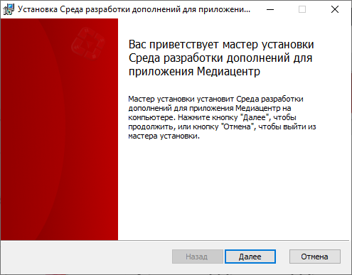

# Среда разработки дополнений для приложения "Медиацентр"

Предназначена для создания, редактирования, отладки кода и сборки дополнений (плагинов).

## Содержание

- [Системные требования](#системные-требования)
- [Установка](#установка)
- [Среда разработки](#среда-разработки)

## Системные требования

| Параметр                 | Требование                       |
| ------------------------ | -------------------------------- |
| Процессор                | С поддержкой системы команд i686 |
| Операционная система     | Windows 7 и выше                 |
| Оперативная память       | 1024 МБ и больше                 |
| Разрешение экрана        | Рекомендуется не менее 1024x768  |
| Доступное место на диске | Рекомендуется не менее 100 МБ    |

[Вернуться к содержанию](#содержание) | [Вернуться в начало раздела](#системные-требования)

## Установка

- Скачайте установочный пакет [mediacenter-tools-0.3.4-win32.msi](http://files.iconbit.com/IMC/tools/mediacenter-tools-0.3.4-win32.msi) (старая версия [mediacenter-tools-0.3.3-win32.msi](http://files.iconbit.com/IMC/tools/mediacenter-tools-0.3.3-win32.msi))
- Запустите пакет и в окне приветствия нажмите "Далее"

- Ознакомьтесь с условиями использования. Если вы принимаете условия данного соглашения то поставьте галочку напротив соответствующей надписи и нажмите кнопку "Далее". Если вы не принимаете данное соглашение то нажмите кнопку "Отмена" и прекратите установку.

- Выберите место для установки среды разработки. Избегайте установки в каталог "Program Files" и длинного пути установки. Нажмите "Далее"

- Чтобы приступить к установке нажмите "Установить"

- Дождитесь завершения установки. Чтобы закрыть установщик нажмите "Готово"

[Вернуться к содержанию](#содержание) | [Вернуться в начало раздела](#установка)

## Среда разработки

В состав среды разработки входит:

- Текстовый редактор [SciTE](https://www.scintilla.org/SciTEDoc.html)
- Утилита отладки кода и сборки дополнений
- Мастер создания дополнения на основании шаблона (другого дополнения)
- Документация по разработке дополнений

Каталог установки содержит:

- **src** - каталог для хранения исходных текстов дополнений или шаблонов
- **IMC** - каталог сборки дополнений

### Запуск

В результате установки среды разработки на рабочем столе появится ярлык **Редактор дополнений для приложения Медиацентр**.

При запуске ярлыка откроется текстовый редактор [SciTE](https://www.scintilla.org/SciTEDoc.html).

### Создание дополнения

Откройте редактор дополнений и в меню "Сервис" выберите "Создать дополнение".

В открытом диалоге введите идентификатор дополнения (только латинские буквы, цифры, точки и тире) и выберите шаблон. Список шаблонов формируется на основании папки **src**.

Нажмите кнопку "ОК". В результате будет произведено копирование файлов из каталога шаблона в новый каталог под именем введенного идентификатора, в редакторе будут открыты основной модуль и конфигурационный файл.

### Функции

В меню "Сервис" в зависимости от активного файла доступны следующие функции:

- **Собрать** - Собрать дополнение *.IMC.zip в каталоге **IMC**
- **Выполнить** - Выполнить текущий модуль. Если в редакторе выделен текст (внутренняя ссылка) то будет произведена эмуляция открытия внутренней ссылки как в приложении Медиацентр с выводом результата в виде JSON текста
- **Открыть консоль** - Открыть командную строку в  каталоге исполняемых файлов
- **Открыть папку документа** - Открыть каталог активного файла
- **Открыть папку сборки** - Открыть каталог **IMC**
- **Запустить на устройстве** - Собрать дополнение и запустить на устройстве с использованием Android Debug Bridge (adb). Каталог с adb должен быть прописан в переменной окружения **PATH**, а также должно быть установлено соединение с устройством.
- **Открыть лог устройства** - Открыть лог устройства с использованием adb в терминале

[Вернуться к содержанию](#содержание) | [Вернуться в начало раздела](#среда-разработки)